## Задание 1. Создать и настроить репозиторий для дальнейшей работы на курсе.

### Создание репозитория и первого коммита

1. Зарегистрируйте аккаунт на https://github.com/ (если вы предпочитаете другое хранилище для репозитория, можно использовать его):  

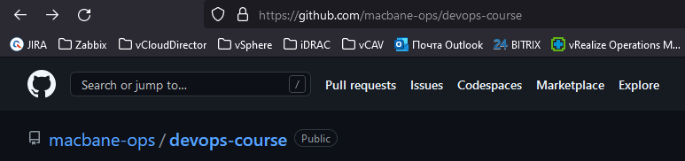  

2. Создайте публичный репозиторий, который будете использовать дальше на протяжении всего курса. Обязательно поставьте галочку Initialize this repository with a README:
Ссылка на репозиторий: https://github.com/macbane-ops/devops-course  

3. Создайте авторизационный токен для клонирования репозитория:
Ссылка: https://github.com/macbane-ops/devops-course.git  

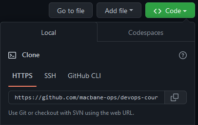  

4. Перейдите в каталог с репозиторием:

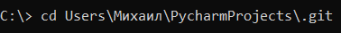  

5. Произведите первоначальную настройку Git:  

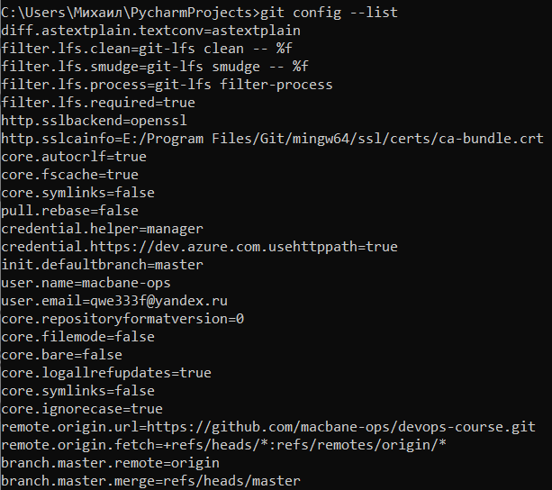  

6. Выполните команду **git status**:  

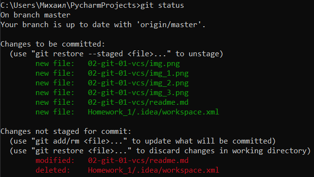  

7. Просмотр изменений в файле командой **git diff**:  

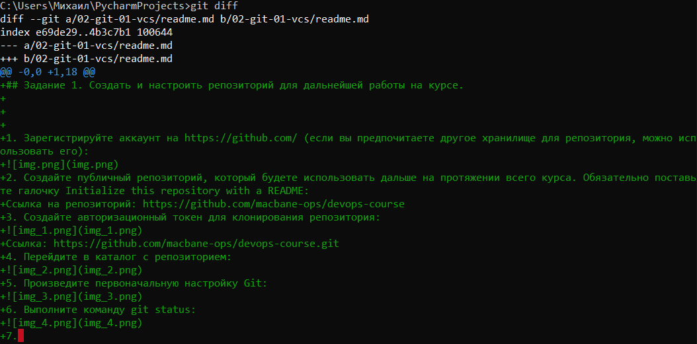  

8. Просмотр изменений в файле командой **git diff --staged**:  

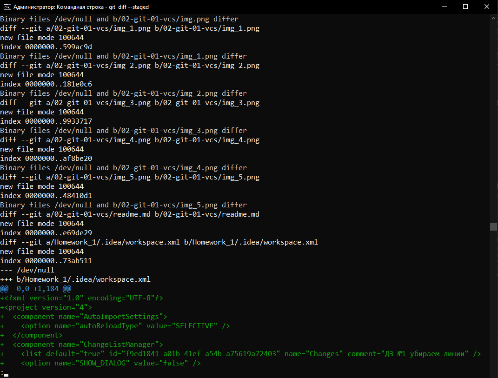  

9. Первый коммит:  

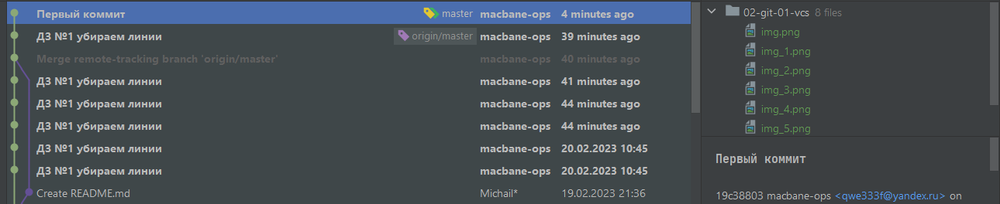  

10. Проверка **git status** после первого commit():  

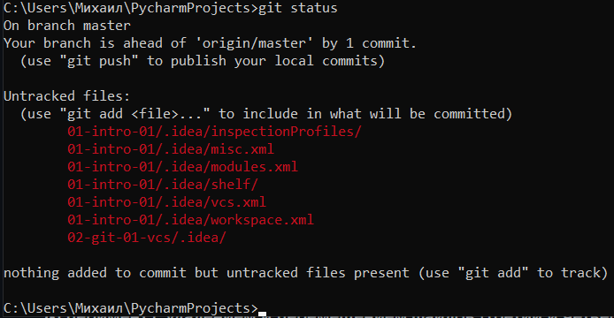  

### Создание файлов **.gitignore** и второго коммита
1. Создайте файл .gitignore:  

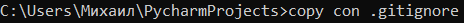  

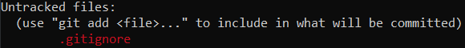  

2. Добавьте файл **.gitignore** в следующий коммит:  

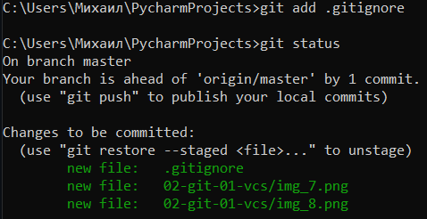  

3. Создадим каталог terraform и внутри этого каталога файл .gitignore по примеру https://github.com/github/gitignore/blob/master/Terraform.gitignore:  

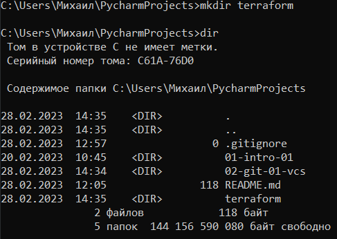  

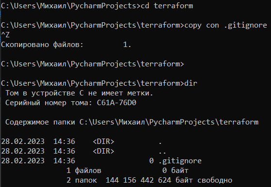  

4. Опишите своими словами, какие файлы будут проигнорированы в будущем благодаря gitignore:
* локальные директории terraform
* crash-файлы логов
* файлы с приватными данными: ключи, пароли и т.д.,то что не должно находиться в СКВ
* файлы-конфиги CLI
* файлы локального перераспределения ресурсов
5. Все изменения закоммичены:  

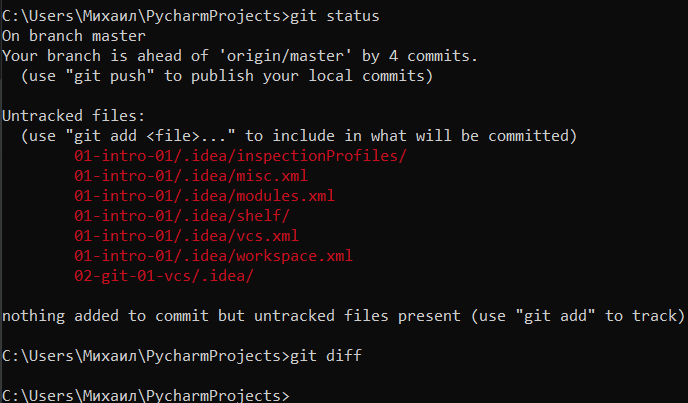  

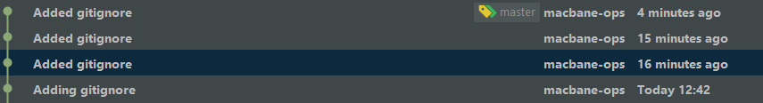  

### Удаление и перемещение файлов

1. Создайте файлы **will_be_deleted.txt** (с текстом will_be_deleted) и **will_be_moved.txt** (с текстом will_be_moved) и закоммите их с комментарием **Prepare to delete and move**.  

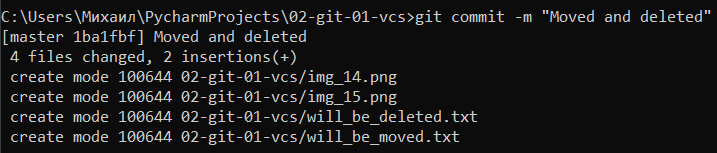  

2. Удалите файл **will_be_deleted.txt** с диска и с репозитория:  

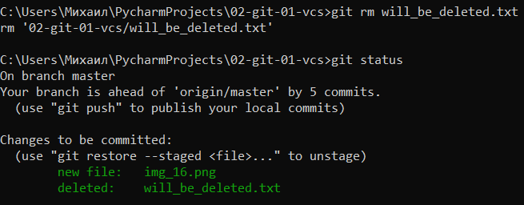  

3. Переименуйте (переместите) файл **will_be_moved.txt** на диске и в репозитории, чтобы он стал называться **has_been_moved.txt**  

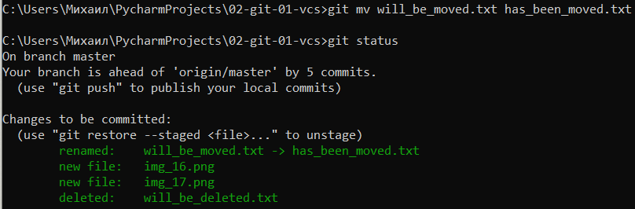  

4. Закоммитьте результат работы с комментарием **Moved and deleted**  

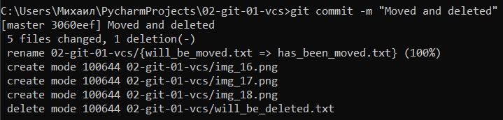  

### Проверка изменений
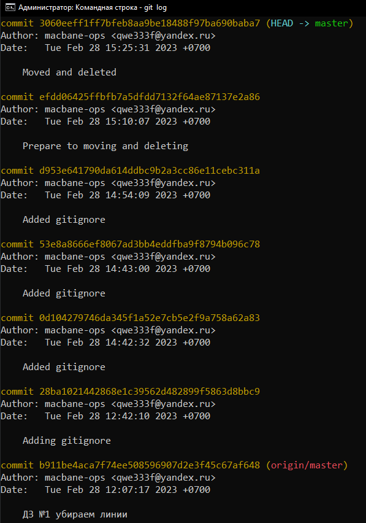  

### Отправка изменений в репозиторий

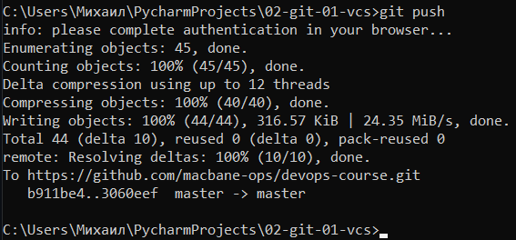