### Задание 1. Знакомимся с GitLab

1. Регистрируем аккаунт:  
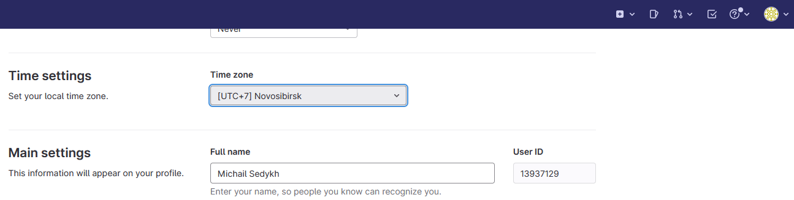  
2. Создать новый проект:  
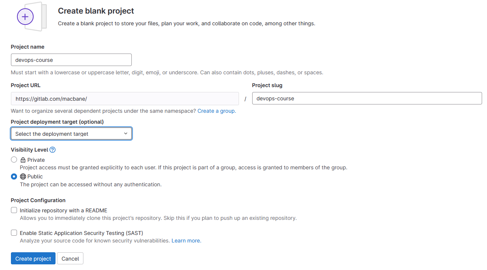  
3. Запомните вывод **git remote -v**:  
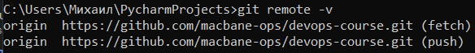  
4. Добавляем созданный gitlab репoзиторий как дополнительный:  
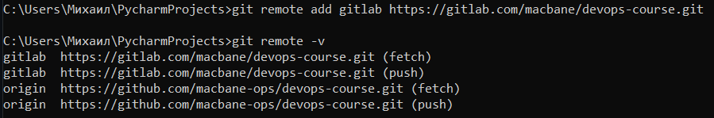  
5. Отправляем изменения в новый репозиторий:  
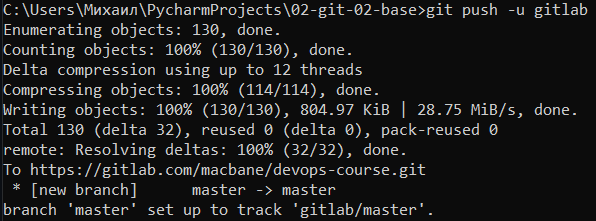  

### Задание 2. Тэги

1. Создайте легковесный тэг v0.0 и аннотированный тэг v0.1 и запушьте его на 2 upstream. По умолчанию, команда git push не отправляет теги на удалённые сервера. После создания теги нужно отправлять явно на удалённый сервер. Процесс аналогичен отправке веток - достаточно выполнить команду **git push origin tagname**.  
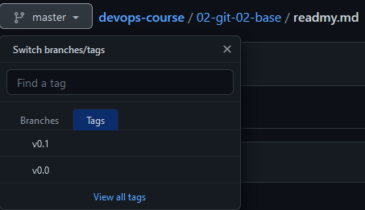  
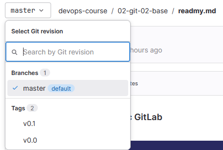  
2. Проверить, чем отличаются тэги:  
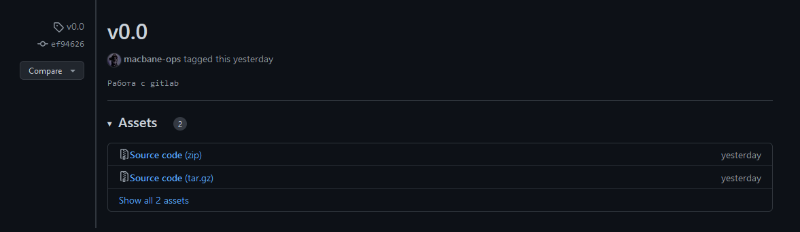  
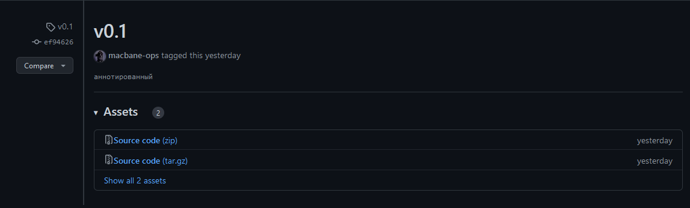  

### Задание 3. Ветки

1. Переключитесь на ветку, связанную с github:  
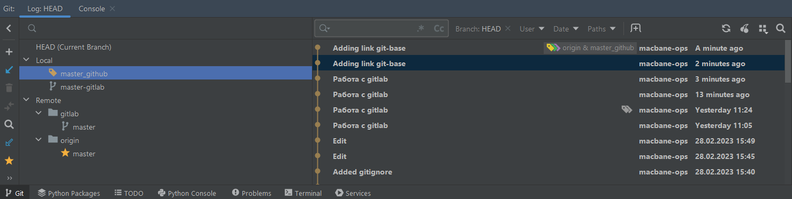  
2. Посмотрите лог коммитов и найдите хеш коммита с названием Prepare to delete and move, который был создан в пределах предыдущего домашнего задания.  
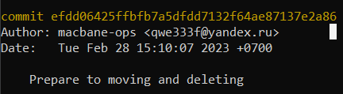  
3. Выполните git checkout по хешу найденного коммита:  
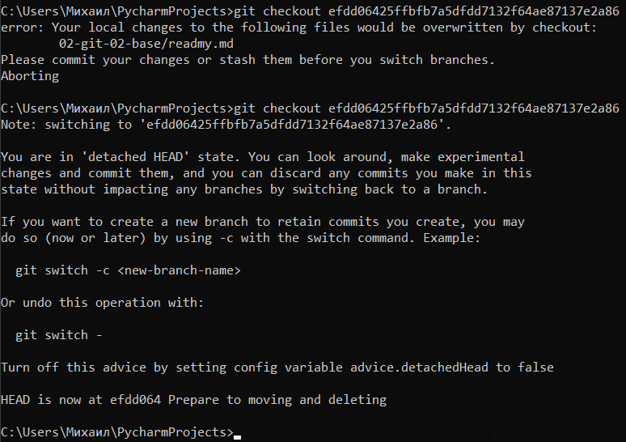  
4. Создайте новую ветку fix:  
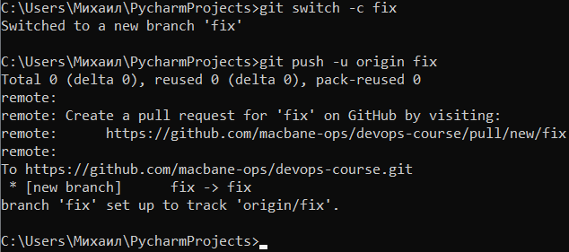  
5. Отправьте новую ветку в репо на github:  
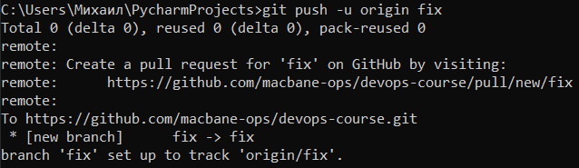  
6. Посмотрите на визуальную схему коммитов:  
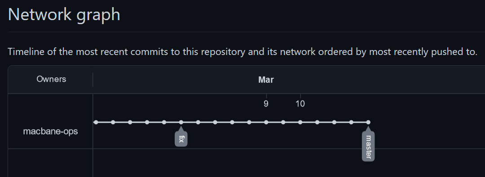  
7. Измените содержание README.md добавив новую строчку:  
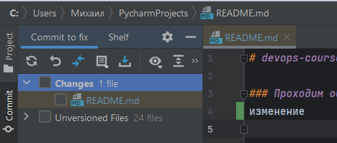  
8. Отправьте изменения в репозиторий и посмотрите, как изменится схема на странице и как изменится вывод команды git log:  
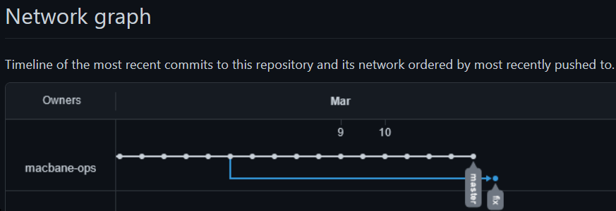  
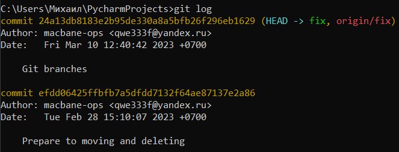  

### Задание 4. Использование IDE

1. В IDE PyCharm откройте Git:  
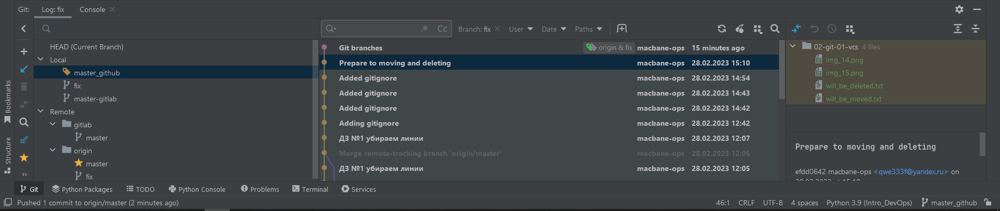  
2. Измените какой-нибудь файл:  
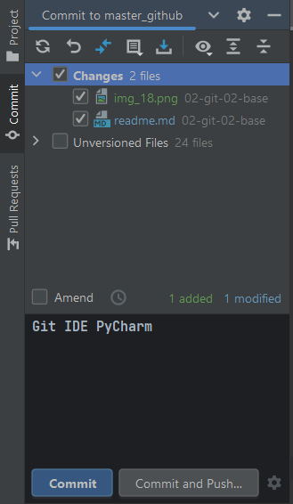  
3. Выполнить коммит:  

