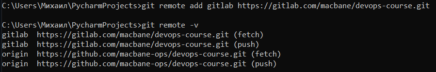

### Задание 1. Знакомимся с GitLab

1. Регистрируем аккаунт:  
  
2. Создать новый проект:  
  
3. Запомните вывод **git remote -v**:  
  
4. Добавляем созданный gitlab репoзиторий как дополнительный:  
  
5. Отправляем изменения в новый репозиторий:  
