### Задание 1. Ветвление, merge and rebase  
  
1. Создайте в своем репозитории каталог branching, а в нём файлы **merge.sh** и **rebase.sh**:  
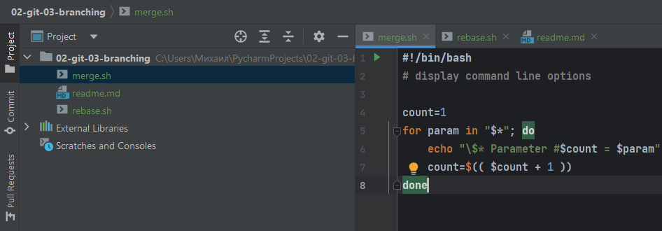  
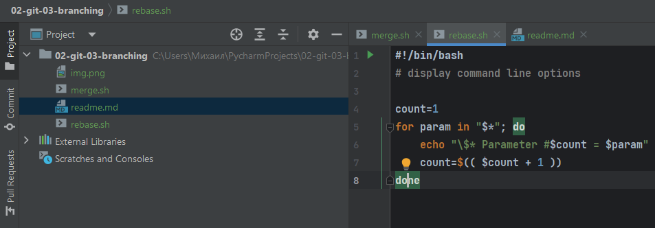  
2. Создадим коммит с описанием prepare for merge and rebase и отправим его в ветку **master**:  
  

#### Подготовка файла **merge.sh**  
1. Создайте ветку git-merge:  
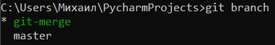  
2. Замените в ней содержание **merge.sh**:  
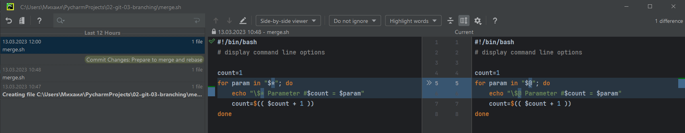  
3. Создайте коммит _merge: @ instead *_ отправьте изменения в репозиторий:  
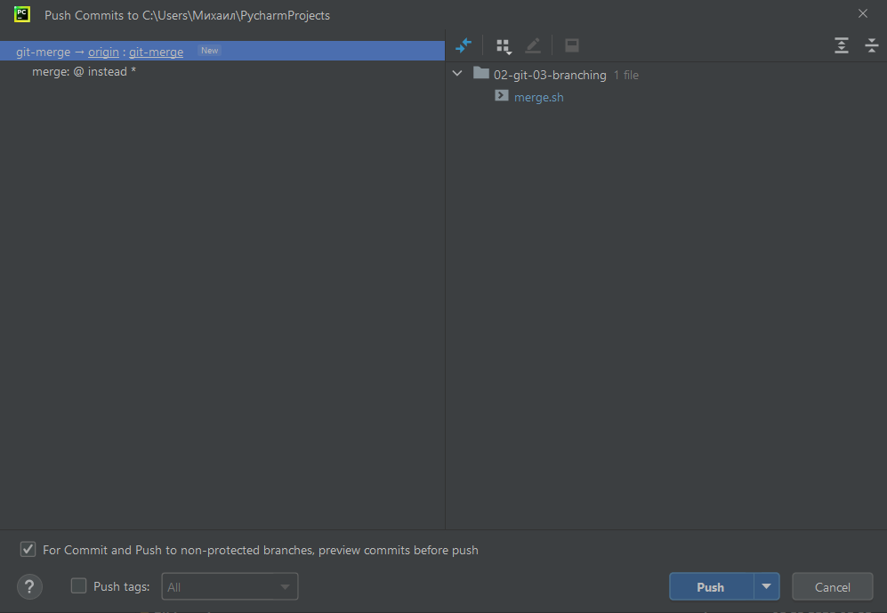  
4. Внесите еще одно изменение в **merge.sh**:  
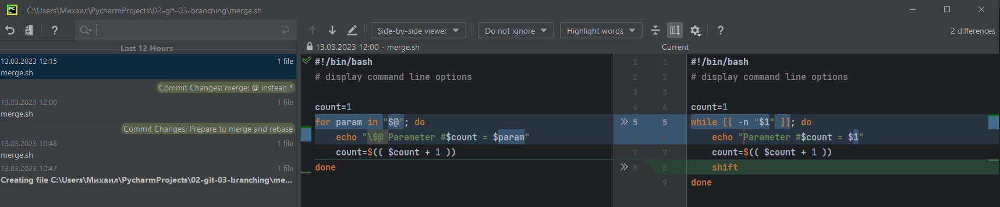  
5. Создайте коммит _merge: use shift_ и отправьте изменения в репозиторий:  
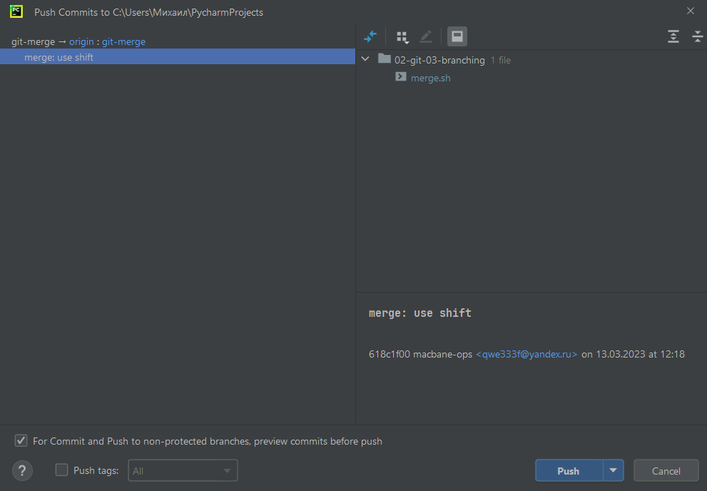  

#### Изменение main  
1. Вернитесь в ветку master:  
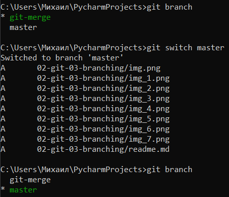  
2. Предположим, что кто-то, пока мы работали над веткой git-merge, изменил main. Для этого изменим содержимое файла **rebase.sh** на следующее:  
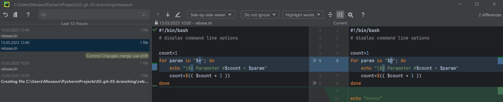  
3. Отправляем измененную ветку main в репозиторий:  
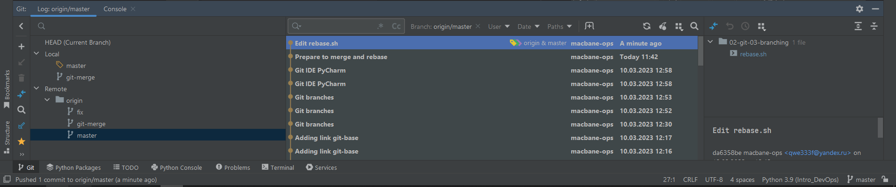  

#### Подготовка файла rebase.sh  
1. Предположим, что теперь другой участник нашей команды не сделал git pull, либо просто хотел ответвиться не от последнего коммита в main, а от коммита когда мы только создали два файла merge.sh и rebase.sh на первом шаге.
Для этого при помощи команды git log найдем хэш коммита _prepare for merge and rebase_ и выполним **git checkout** на него:  
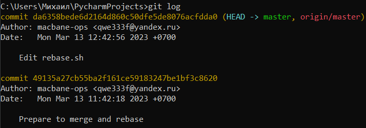  
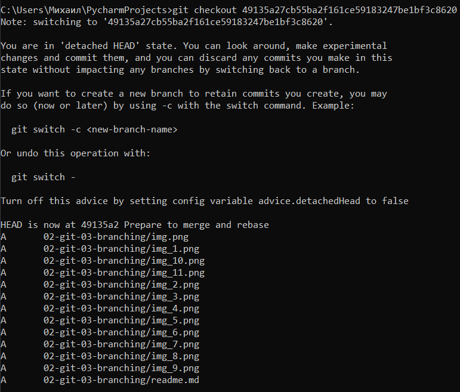  
2. Создадим ветку **git-rebase** основываясь на текущем коммите:  
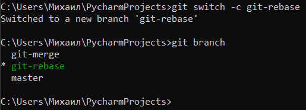  
3. Изменим содержимое файла **rebase.sh**:  
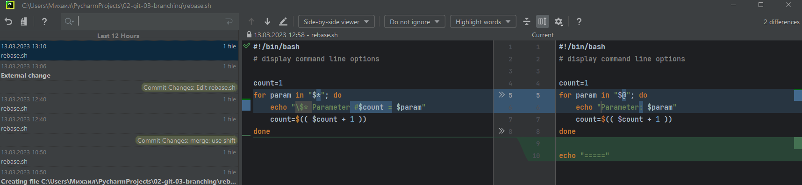  
4. Отправим эти изменения в ветку **git-rebase**, с комментарием _git-rebase 1_:  
  
5. И сделаем еще один коммит git-rebase 2 с пушем заменив _echo "Parameter: $param"_ на _echo "Next parameter: $param"_ :  
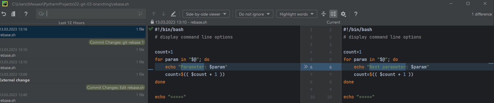  
  

#### Промежуточный итог
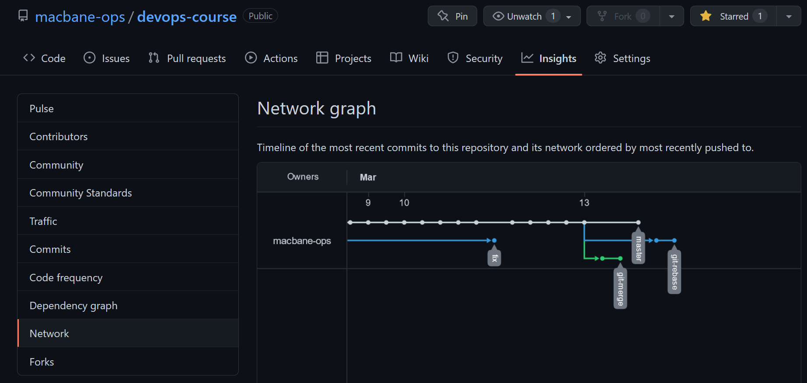  

#### Merge
1. Сливаем ветку **git-merge** в **master** и отправляем изменения в репозиторий, должно получиться без конфликтов. Для начала переключаемся на master:  
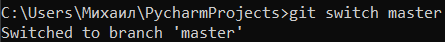  
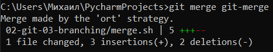  
2. Схема результата:  
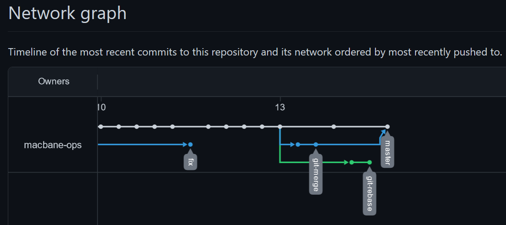  

#### Rebase  
1. Переключаемся на ветку **git-rebase** и выполняем _git rebase -i main_. В открывшемся диалоге должно быть два выполненных нами коммита, давайте заодно объединим их в один, указав слева от нижнего fixup:  
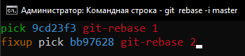  
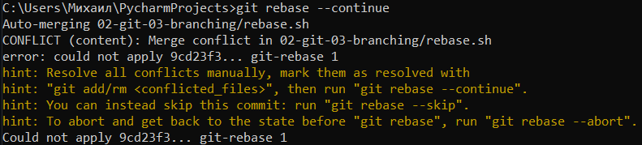  
2. Решаем конфликт вручную, удалив метки, затем git add rebase.sh и продолжим ребейз git rebase --continue:  
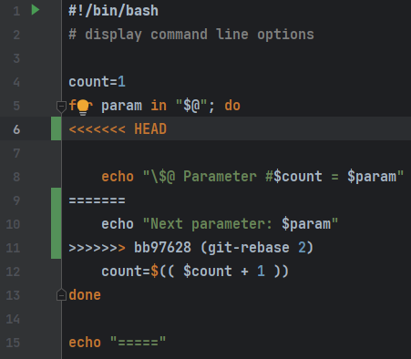  
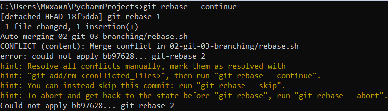  
3. Аналогично разрешаем второй конфликт и продолжаем ребейз:
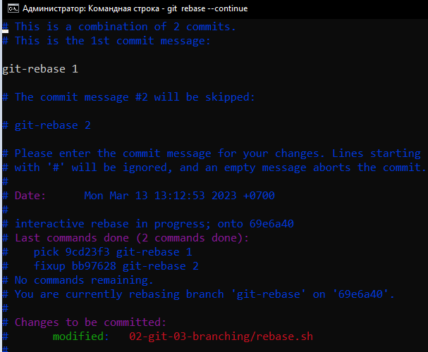  
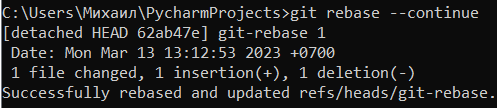  
4. И попробуем выполнить git push, либо git push -u origin git-rebase чтобы точно указать что и куда мы хотим запушить. Эта команда завершится с ошибкой:  
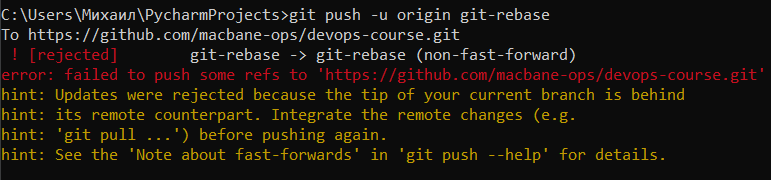  
5. Добавляем флаг **-force**:  

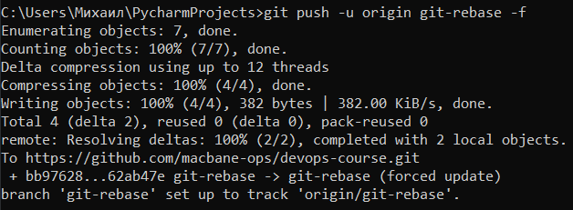  
6. Теперь можно смержить ветку git-rebase в main без конфликтов и без дополнительного мерж-комита простой перемоткой:  
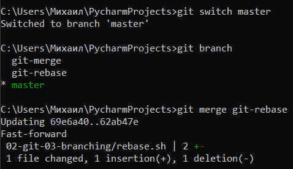
