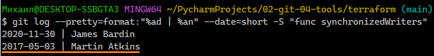

### Задание 1. Инструменты Git  

1. Склонируйте репозиторий с исходным кодом Terraform:  
  
2. Найдите полный хеш и комментарий коммита, хеш которого начинается на **aefea**:  
  
Через cmd не удалось, открыл через Git Bash:  
  
  
3. Какому тегу соответствует коммит **85024d3**:  
  
4. Сколько родителей у коммита b8d720? Напишите их хеши:  
  
Получается, что родителя 2(первый хеш, это сам коммит b8d720).  
5. Перечислите хеши и комментарии всех коммитов которые были сделаны между тегами **v0.12.23** и **v0.12.24**:  
  
6. Найдите коммит в котором была создана функция **func providerSource**, ее определение в коде выглядит так **func providerSource(...)** (вместо троеточия перечислены аргументы):  
  
7. Найдите все коммиты в которых была изменена функция **globalPluginDirs**:  
  
8. Кто автор функции **synchronizedWriters**:  
