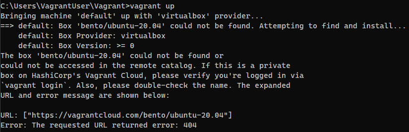
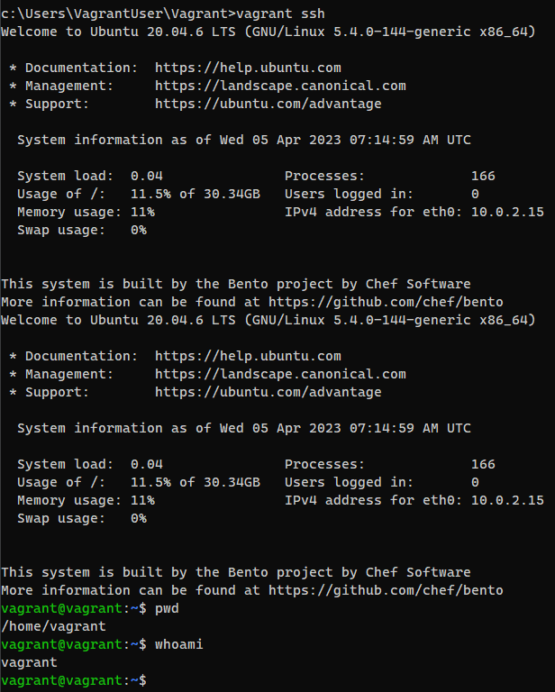

### Задание 1. Работа в терминале  

#### С помощью базового файла конфигурации запустите Ubuntu 20.04 в VirtualBox посредством Vagrant:  
1. Создайте директорию, в которой будут храниться конфигурационные файлы Vagrant. В ней выполните **vagrant init**. Замените содержимое Vagrantfile по умолчанию следующим:  

2. Выполнение в этой директории vagrant up установит провайдер VirtualBox для Vagrant, скачает необходимый образ и запустит виртуальную машину:  
  
Без VPNa доступ закрыт, подрубил VPN - пробуем:   
  

3. Графический интерфейс VirtualBox:  
  
4. Конфиг ВМ через **vagrantfile** (CPU и RAM):  
  
5. Команда **vagrant ssh** из инициированной директории:  
  
6. Длина журнала **history**:  
  
   Про **ignoreboth**:  
  
7. Скобки (braces) **{}** в manual:  
  
8. С учётом ответа на предыдущий вопрос, как создать однократным вызовом touch 100000 файлов? Получится ли аналогичным образом создать 300000? Если нет, то почему? 
_**300000 создать нельзя, т.к. в команде будет превышен список аргументов**_:  
  
9. Что делает конструкция **[[ -d /tmp ]]** :    
_**Проверяет, существует ли tmp и является ли каталогом.**_  
  
10. Сделайте так, чтобы в выводе команды type -a bash первым стояла запись с нестандартным путем, например bash is ... Используйте знания о просмотре существующих и создании новых переменных окружения, обратите внимание на переменную окружения PATH:    
  
11. Чем отличается планирование команд с помощью **batch** и **at**?  
**batch** - планирует задания и выполняет их в очереди пакетов, когда позволяет уровень загрузки системы. По умолчанию задания выполняются, когда средняя загрузка системы ниже 1,5. Значение загрузки может быть указано при вызове демона atd. Если средняя загрузка системы выше указанной, задания будут ждать в очереди(нагрузка может быть переопределена на другое значение)  
**at** - выполняет задание в указанное время  
12. Завершите работу виртуальной машины:  

    

