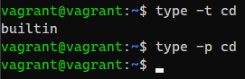

### Задание 2. Работа в терминале

1. Какого типа команда cd? Попробуйте объяснить, почему она именно такого типа: опишите ход своих мыслей, если считаете, что она могла бы быть другого типа.  
_Команда `cd` - внутренняя команда оболочки. Она могла бы подходить под тип "исполняемый файл", но т.к. `type -p cd` не дает ничего на выход - остается только внутренняя команда:_  
  
2. Какая альтернатива без pipe команде `grep <some_string> <some_file> | wc -l`?  
