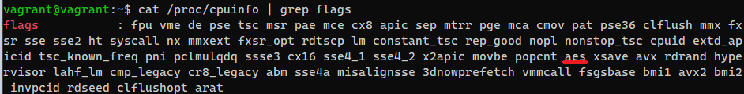

### Задание 2. Работа в терминале

1. **Какого типа команда cd? Попробуйте объяснить, почему она именно такого типа: опишите ход своих мыслей, если считаете, что она могла бы быть другого типа.**  
_Команда `cd` - внутренняя команда оболочки. Она могла бы подходить под тип "исполняемый файл", но т.к. `type -p cd` не дает ничего на выход - остается только внутренняя команда:_  
  
2. **Какая альтернатива без pipe команде `grep <some_string> <some_file> | wc -l`?**  

3. **Какой процесс с PID 1 является родителем для всех процессов в вашей виртуальной машине Ubuntu 20.04?**  
_Процесс **init**:_  
  
4. **Как будет выглядеть команда, которая перенаправит вывод `stderr ls` на другую сессию терминала?**  
`ls % 2> /dev/pts/0`
  
5. **Получится ли одновременно передать команде файл на **stdin** и вывести ее **stdout** в другой файл? Приведите работающий пример.**  

6. **Получится ли, находясь в графическом режиме, вывести данные из PTY в какой-либо из эмуляторов TTY? Сможете ли вы наблюдать выводимые данные?**  
_Ответ - да._  

7. **Выполните команду `bash 5>&1`. К чему она приведет? Что будет, если вы выполните `echo netology > /proc/$$/fd/5`? Почему так происходит?**  
Выполнение команды приведет к переназначению ввода дескриптора 5 на обычный ввод-вывод. Поэтому, если мы выполним `echo netology > /proc/$$/fd/5` - нам в консоль выведет "netology":  
  
8. **Получится ли в качестве входного потока для pipe использовать только stderr команды, не потеряв при этом отображение stdout на pty?**
Напоминаем: по умолчанию через pipe передается только stdout команды слева от | на stdin команды справа. Это можно сделать, поменяв стандартные потоки местами через промежуточный новый дескриптор, который вы научились создавать в предыдущем вопросе.  

9. **Что выведет команда `cat /proc/$$/environ`? Как еще можно получить аналогичный по содержанию вывод?**  
cat /proc/$$/environ выведет содержание файла environ, который содержит переменные окружения, заданные на этапе запуска процесса($$). Аналогичный и более читаемый вывод с xargs:  
  
10. **Используя man, опишите что доступно по адресам `/proc/PID/cmdline`, `/proc/PID/exe`.**  
`proc/<PID>/cmdline` - _содержит параметры командной строки, переданные на этапе запуска процесса._  
`proc/<PID>/exe` - _ссылка на оригинальный исполняемый файл_
11. **Узнайте, какую наиболее старшую версию набора инструкций SSE поддерживает ваш процессор с помощью `/proc/cpuinfo`**.  
  
12. **При открытии нового окна терминала и vagrant ssh создается новая сессия и выделяется pty.
Это можно подтвердить командой tty, которая упоминалась в лекции 3.2.**  
   
**Почему так происходит и как изменить поведение?**  
_По умолчанию, когда вы выполняете команду на удаленной машине с помощью ssh, TTY не выделяется для удаленной сессии._  
  
13. **Бывает, что есть необходимость переместить запущенный процесс из одной сессии в другую. Попробуйте сделать это, воспользовавшись `reptyr`. Например, так можно перенести в screen процесс, который вы запустили по ошибке в обычной SSH-сессии.**  
  
  
   

  
14. **`sudo echo string > /root/new_file` не даст выполнить перенаправление под обычным пользователем, так как перенаправлением занимается процесс shell'а, который запущен без sudo под вашим пользователем. Для решения данной проблемы можно использовать конструкцию `echo string | sudo tee /root/new_file`. Узнайте? что делает команда `tee` и почему в отличие от `sudo echo` команда с `sudo tee` будет работать.**  
_Команда `tee` считывает стандартный ввод (stdin), после чего записывает его в стандартный вывод (stdout) и одновременно копирует его в подготовленный файл или переменную._  
