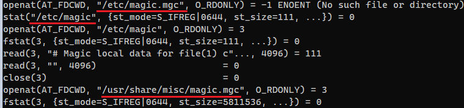

### Задание 1. Операционные системы

1.  **Какой системный вызов делает команда `cd`?**  
_При выполнении команды `strace sh -c 'cd /tmp'` получаем вывод:_  
  
_chdir ("PATH") - это функция, устанавливающая текущий каталог на тот, что указан в PATH, в нашем случае - `/tmp`_  
2. **Используя `strace` выясните, где находится база данных `file`, на основании которой она делает свои догадки.**  
  
_Вводим_ `strace 'file'`:  
  
_Сначала через функцию возврата информации о файле file пытается проверить файлы со скрина, затем обращается к:_  
  
3. **Предположим, приложение пишет лог в текстовый файл. Этот файл оказался удален (deleted в lsof), однако возможности сигналом сказать приложению переоткрыть файлы или просто перезапустить приложение – нет. Так как приложение продолжает писать в удаленный файл, место на диске постепенно заканчивается. Основываясь на знаниях о перенаправлении потоков предложите способ обнуления открытого удаленного файла (чтобы освободить место на файловой системе).**  
Выполнить `truncate`:  
  
  
  
4. **Занимают ли зомби-процессы какие-то ресурсы в ОС (CPU, RAM, IO)?**  
_Нет, зомби-процессы не занимают системные ресурсы._  
5. **В iovisor BCC есть утилита `opensnoop`. На какие файлы вы увидели вызовы в первую секунду работы программы?**  
  
6. **Какой системный вызов использует `uname -a`? Приведите цитату из man по этому системному вызову, где описывается альтернативное местоположение в `/proc`, где можно узнать версию ядра и релиз ОС.**  
_Part of the utsname information is also accessible via `/proc/sys/kernel`/{ostype, hostname, osrelease, version, domainname}_. (Source - man uname(2))  
7. **Чем отличается последовательность команд через `;` и через `&&` в bash?**  
_Судя по выводу:_  
  
_`;` - последовательное выполнение команд,`&&` - следующая команда сработает только в случае успешного выполнения предыдущей._ (каталога some_dir не существует, вот и вывода нет).    
**Есть ли смысл использовать `&&` в bash с `set -e`?**  
_Да, думаю, что используется в скриптах._  
8.  **Из каких опций состоит режим bash `set -euxo pipefail` и почему его хорошо было бы использовать в сценариях?**  
`-e` 	(errexit) 	_Прерывает работу сценария при появлении первой же ошибки (когда команда возвращает ненулевой код завершения)_  
`-u` 	(nounset) 	_При попытке обращения к неопределенным переменным, выдает сообщение об ошибке и прерывает работу сценария_  
`-x` 	(xtrace) 	_Подобна -v, но выполняет подстановку команд_  
`-o` _Устанавливает или снимает опцию по её длинному имени_ (в нашем случае `pipefail`).  
`pipefail` _Если опция pipefail включена — статус выхода из конвейера является значением последней (самой правой) команды, завершённой с ненулевым статусом, или ноль — если работа всех команд завершена успешно._  

_Режим `set -euxo pipefail` хорошо использовать в сценариях bash, т.к. оболочка не имеет средств защиты, в отличии от высокоуровневых ЯП._   

9. **Используя `-o stat` для `ps`, определите, какой наиболее часто встречающийся статус у процессов в системе. В man ps ознакомьтесь (/PROCESS STATE CODES) что значат дополнительные к основной заглавной буквы статуса процессов.**   
  
