### Задание 2. Операционные системы

1. **Cоздайте самостоятельно простой unit-файл для node_exporter.**  
_Для начала устанавливаем node_exporter для линукс:_  
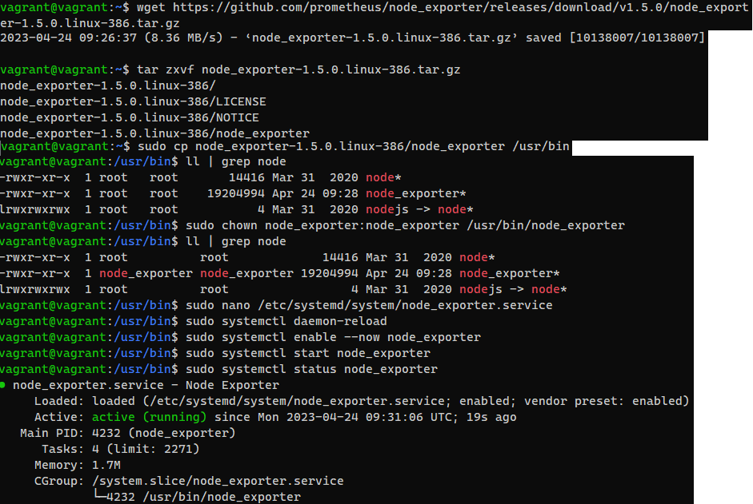  
_Сам unit-файл:_  
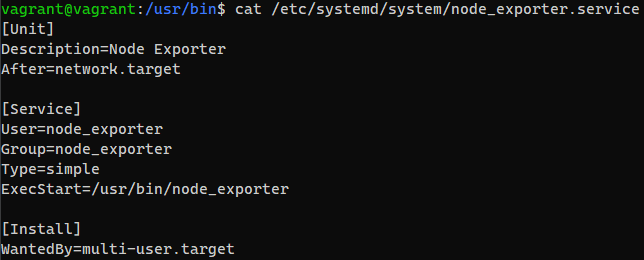  
_Проверка запуска после перезагрузки:_  
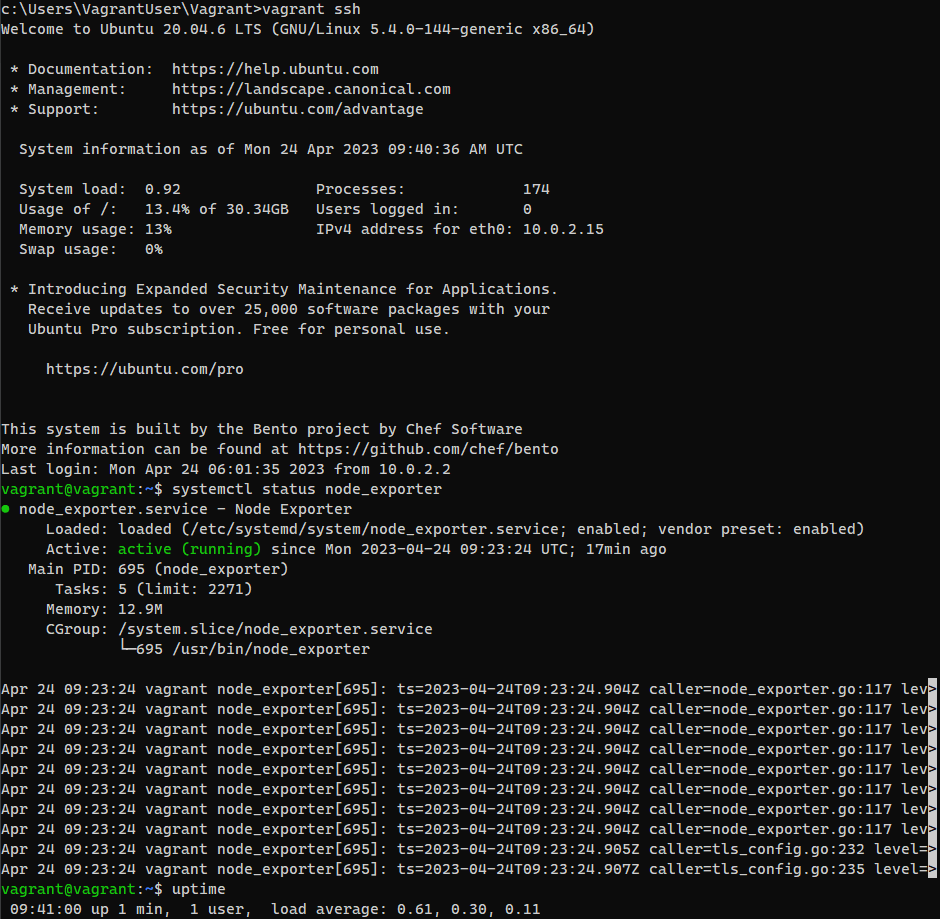  
2. **Ознакомьтесь с опциями node_exporter и выводом /metrics по-умолчанию. Приведите несколько опций, которые вы бы выбрали для базового мониторинга хоста по CPU, памяти, диску и сети.**  

_CPU:_

    node_cpu_seconds_total{cpu="0",mode="idle"}    
    node_cpu_seconds_total{cpu="0",mode="system"}   
    node_cpu_seconds_total{cpu="0",mode="user"}     
    process_cpu_seconds_total 

_RAM_

    node_memory_MemAvailable_bytes
    node_memory_MemFree_bytes
    node_memory_Buffers_bytes
    node_memory_Cached_bytes

_Disks_

    node_disk_io_time_seconds_total{device="sda"}
    node_disk_read_time_seconds_total{device="sda"}
    node_disk_write_time_seconds_total{device="sda"}
    node_filesystem_avail_bytes

_Network_

    node_network_info
    node_network_receive_bytes_total
    node_network_receive_errs_total
    node_network_transmit_bytes_total
    node_network_transmit_errs_total  

3. **Установите в свою виртуальную машину Netdata. Воспользуйтесь готовыми пакетами для установки (`sudo apt install -y netdata`).**  
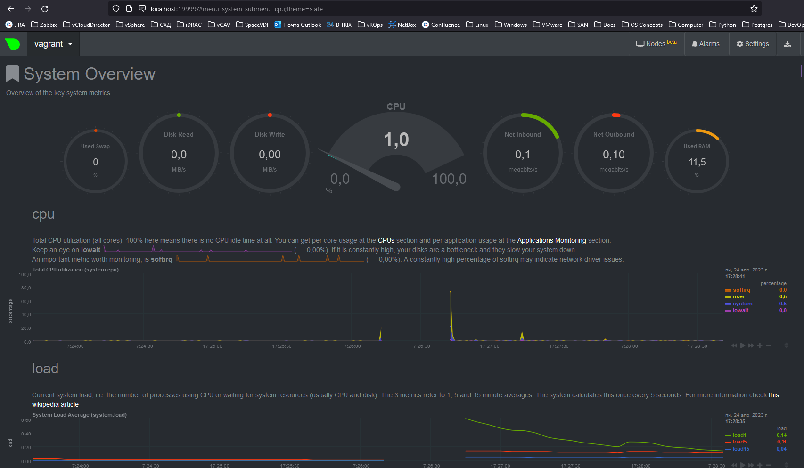    
4. **Можно ли по выводу `dmesg` понять, осознает ли ОС, что загружена не на настоящем оборудовании, а на системе виртуализации?**  
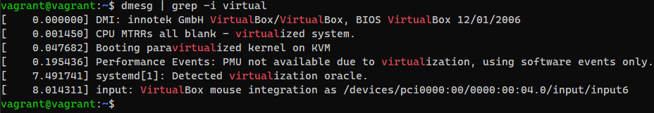  
5. **Как настроен `sysctl fs.nr_open` на системе по-умолчанию?**  
_Максимальное число дескрипторов, которые процесс может использовать:_  
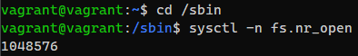  
_Достичь значения не даст:_  
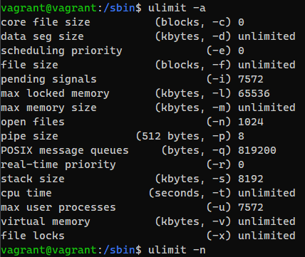  
6. **Запустите любой долгоживущий процесс (не ls, который отработает мгновенно, а, например, sleep 1h) в отдельном неймспейсе процессов; покажите, что ваш процесс работает под PID 1 через nsenter**.  
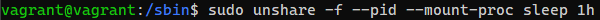  
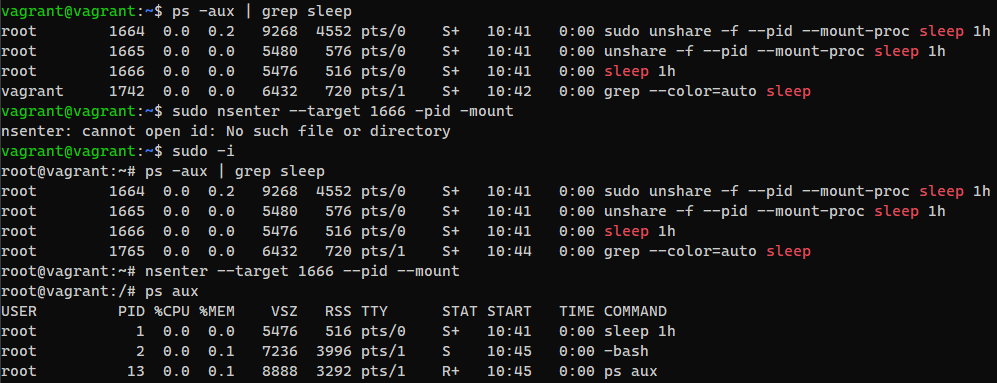  
7. **Найдите информацию о том, что такое `:(){ :|:& };:`.**  
Форк-бомба - программа, порождающая себя n-раз

`:()` — Определение функции.   
`{`  — Открытие функции.  
`:|:` — Далее, загружает копию функции «:» в память тем самым, будет вызывать само себя с использованием техники программирования ( так называемая рекурсия) и передает результат на другой вызов функции.   
`‘:’` — Функция, вызываемая два раза, чтобы «бомбить» вашу систему.   
`&` — Помещает вызов функции в фоновом режиме, чтобы fork (дочерний процесс) не мог «умереть» вообще, тем самым это начнет есть системные ресурсы.   
`}` — Закрытие функции.   
`;` — Завершите определение функции. Т.е является разделителем команд, (такой как и &&).  
`:` — Запускает функцию которая порождает fork bomb().  
  
**Вызов dmesg расскажет, какой механизм помог автоматической стабилизации.**
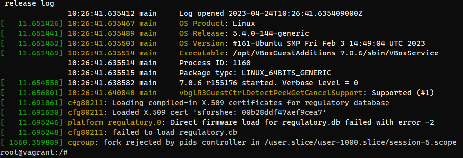  
**Как настроен этот механизм по-умолчанию, и как изменить число процессов, которое можно создать в сессии?**
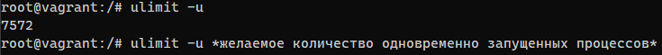

