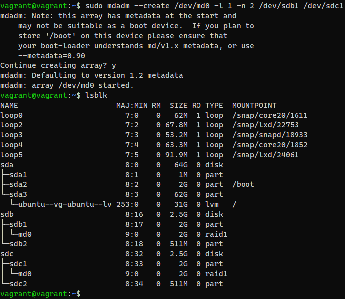

### Задание 1. Файловые системы

1. **Узнайте о sparse-файлах (разряженных).**  

По умолчанию, разреженные файлы являются специальным форматом представления, в котором часть цифровой последовательности заменена сведениями о ней (сформирован перечень дыр), что в свою очередь позволяет гораздо эффективнее задействовать возможности файловой системы. Информация об отсутствующих последовательностях располагается напрямую в метаданных файловой системы, а не занятый высвободившийся объем запоминающего устройства будет использоваться для записи по мере надобности. Такой подход значительно сокращает объем исходного файла и экономит пространство накопителя.

Преимущества:

    - экономия дискового пространства. Использование разрежённых файлов считается одним из способов сжатия данных на уровне файловой системы;
    - отсутствие временных затрат на запись нулевых байт;
    - увеличение срока службы запоминающих устройств.

Недостатки:

    - накладные расходы на работу со списком дыр;
    - фрагментация файла при частой записи данных в дыры;
    - невозможность записи данных в дыры при отсутствии свободного места на диске;
    - невозможность использования других индикаторов дыр, кроме нулевых байт.  
2. **Могут ли файлы, являющиеся жёсткой ссылкой на один объект, иметь разные права доступа и владельца? Почему?**  

Нет, так как жесткая ссылка и файл, для которой она создавалась имеют одинаковые `inode`.  

3. **Сделайте `vagrant destroy` на имеющийся инстанс Ubuntu. Замените содержимое `Vagrantfile`:**  

  
  

4. **Используя `fdisk`, разбейте первый диск на 2 раздела: 2 Гб и оставшееся пространство.**  

  

5. **Используя `sfdisk`, перенесите данную таблицу разделов на второй диск.**  

  
  

6. **Соберите `mdadm` RAID1 на паре разделов 2 Гб:**  

  

7. **Соберите `mdadm` RAID0 на второй паре маленьких разделов:**  

  

8. **Создайте 2 независимых PV(physical volume) на получившихся md-устройствах.**  

  

9. **Создайте общую volume-group на этих двух PV:**  

  

10. **Создайте LV(logical volume) размером 100 Мб, указав его расположение на PV с RAID0.**  

  

11. **Создайте `mkfs.ext4` ФС на получившемся LV.**  

  

12. **Смонтируйте этот раздел в любую директорию, например, `/tmp/new`**  

  

13. **Поместите туда тестовый файл, например** `wget https://mirror.yandex.ru/ubuntu/ls-lR.gz -O /tmp/new/test.gz`  

  

14. **Прикрепите вывод** `lsblk`  

  

15. **Протестируйте целостность файла:**  

  

16. **Используя `pvmove`, переместите содержимое PV с RAID0 на RAID1:**  

  

17. **Сделайте `--fail` на устройство в вашем RAID1 md:**  

  

18. **Подтвердите выводом `dmesg`, что RAID1 работает в деградированном состоянии:**  

  

19. **Протестируйте целостность файла, несмотря на "сбойный" диск он должен продолжать быть доступен:**  

  

20. **Погасите тестовый хост — `vagrant destroy`.**  

