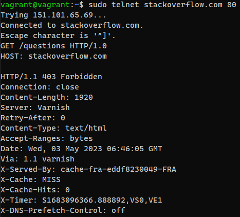

### Домашнее задание к занятию «Компьютерные сети. Лекция 1»  

1. **Работа c HTTP через telnet:**  

  
  
`403 Forbidden` - _Сервер понял запрос, но отказывается его выполнить. Авторизация не поможет, и запрос не следует повторять. Если метод запроса не HEAD и сервер желает сообщить, почему запрос не был выполнен, он должен описать причину отказа в теле сущности. Этот код состояния
обычно используется, когда сервер не хочет раскрывать точную причину отказа в выполнении запроса, или когда нет другого применимого ответа._ 

_В теле написано, что с нашего IP-адреса заблокирован доступ к их сервисам._  

2. **Повторите задание 1 в браузере, используя консоль разработчика F12:**  

_Первый ответ сервера HTTP_ `307 Internal Redirect` означает, что ресурс был временно перемещен в https://stackoverflow.com/ _(Location)_

_Страница загрузилась за 979мс:_

_Самый долгий запрос:_

3. **Какой IP-адрес у вас в интернете?**

_Внешний:_

_Внутренний:_

4. **Какому провайдеру принадлежит ваш IP-адрес? Какой автономной системе AS? Воспользуйтесь утилитой `whois`.**  

  

5. **Через какие сети проходит пакет, отправленный с вашего компьютера на адрес 8.8.8.8? Через какие AS? Воспользуйтесь утилитой `traceroute`.**  

_Используем с флагами:_ 

    -A для отображения AS
    -I для работы с ICMP, т.к. по дефолту отрабатывать не хотело
    -n не сопоставляет IP-адреса с именами хостов при их отображении (побыстрее)

  

6. **Повторите задание 5 в утилите `mtr`. На каком участке наибольшая задержка — delay?**  

_Используем с флагом `-z` для отображения AS:_  

  

_Наибольшие потери на AS:_  

7. **Какие DNS сервера отвечают за доменное имя dns.google? Какие A записи? воспользуйтесь утилитой `dig`.**  

  

8. **Проверьте PTR записи для IP адресов из задания 7. Какое доменное имя привязано к IP? Воспользуйтесь утилитой `dig`.**  

