### Домашнее задание к занятию «Компьютерные сети. Лекция 2» 

1. **Проверьте список доступных сетевых интерфейсов на вашем компьютере. Какие команды есть для этого в Linux и в Windows?**  

Windows CMD:

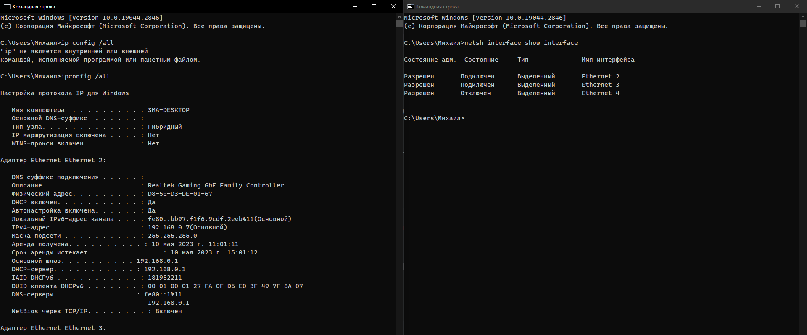  

Windows PowerShell:  

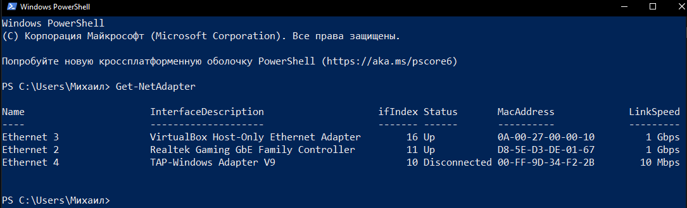  

Linux:  

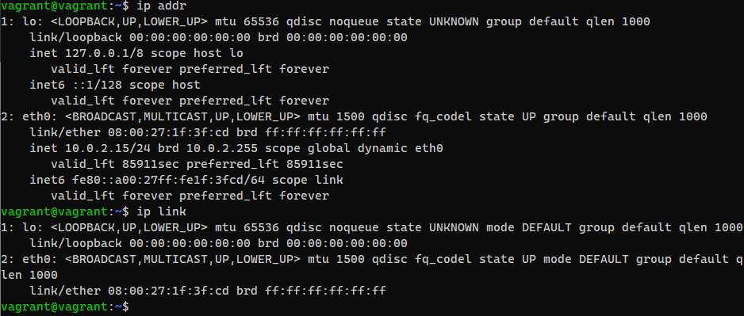  

2. **Какой протокол используется для распознавания соседа по сетевому интерфейсу? Какой пакет и команды есть в Linux для этого?**  

Link Layer Discovery Protocol (LLDP) — протокол канального уровня, позволяющий сетевому оборудованию (коммутаторам, маршрутизаторам, IP-телефонам, беспроводным точкам доступа, узлам и т.д.) оповещать локальную сеть о своем существовании и характеристиках, а также собирать такие же оповещения, поступающие от соседнего оборудования.  

https://manpages.ubuntu.com/manpages/focal/man8/lldpd.8.html  

3. **Какая технология используется для разделения L2 коммутатора на несколько виртуальных сетей? Какой пакет и команды есть в Linux для этого? Приведите пример конфига.**  

VLAN (Virtual Local Area Network).   
В линукс для реализации vlan нужно подгрузить модуль ядра 802.1q:  

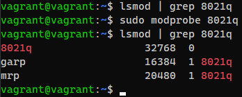  

Устанавливаем пакет `vlan`:

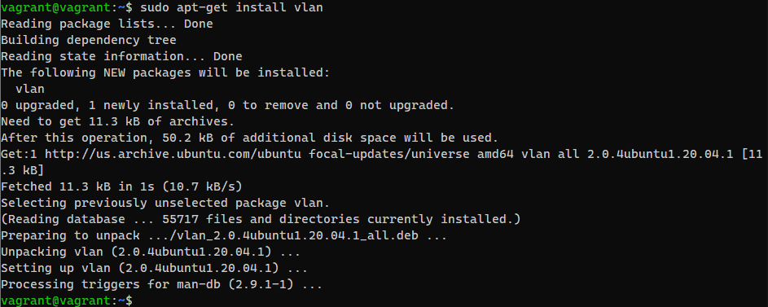

Добавляем интерфейс:  

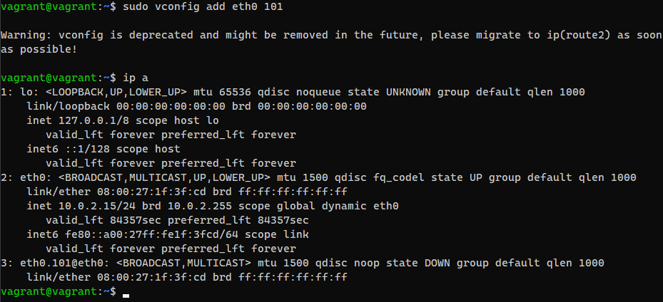  
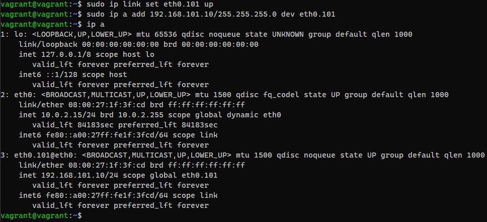  

Редактируем `netplan` для предотвращения удаления созданного интерфейса при следующей загрузке системы:  

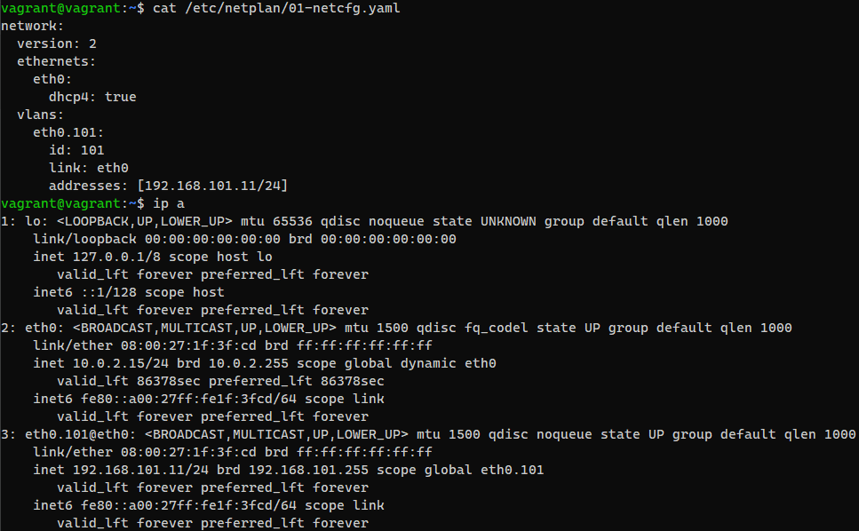  
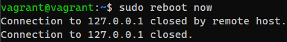  
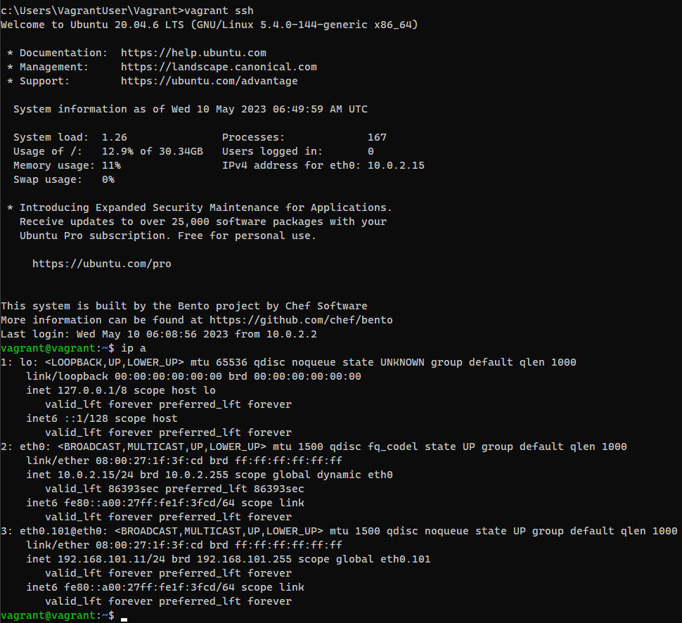  

4. **Какие типы агрегации интерфейсов есть в Linux? Какие опции есть для балансировки нагрузки? Приведите пример конфига.**  

В Linux существуют `Teaming` и `Bonding` - объединение нескольких физических сетевых интерфейсов в один логический, с целью увеличить пропускную способность и/или обеспечить отказоустойчивость.  

Балансировка нагрузки осуществляется в следующих режимах:

- balance-rr - (round-robin)

- active-backup

- balance-xor

- broadcast

- 802.3ad - (dynamic link aggregation)

- balance-tlb - (adaptive transmit load balancing)

- balance-alb - (adaptive load balancing)  

    network:
      version: 2
      renderer: networkd
    ethernets:
      enp3s0f0:
        dhcp4: no
      ensp3s0f1:
        dhcp4: no
    bonds:
      bond0:
        dhcp4: no
        interfaces: [enp3s0f0, enp3s0f1]
        parameters: 

5. **Сколько IP адресов в сети с маской `/29` ? Сколько `/29` подсетей можно получить из сети с маской `/24`. Приведите несколько примеров `/29` подсетей внутри сети `10.10.10.0/24`.**  

В сети с маской `/29` есть 8 IP адресов (-1 адрес broadcast `255.255.255.255` и -1 адрес самой сети, итого - 6 свободных).

Сеть `/24` это 256 адресов, 256/8 = 32 подсети с маской `/29`

Примеры `/29` подсетей внутри сети `10.10.10.0/24`:

        10.10.10.0/29
        10.10.10.8/29
        10.10.10.16/29  

6. **Задача: вас попросили организовать стык между 2-мя организациями. Диапазоны `10.0.0.0/8`, `172.16.0.0/12`, `192.168.0.0/16` уже заняты. Из какой подсети допустимо взять частные IP адреса? Маску выберите из расчета максимум 40-50 хостов внутри подсети.**  

Исходя из количества хостов подходит `/26` маска, включающая 64 адреса. 

`/25` включает 32, чего в нашем случае недостаточно.

Так как основные подсети заняты - можем использовать `100.64.0.0/26`

        Shared address space for communications between a service provider and its subscribers 
        when using a carrier-grade NAT. Согласно RFC6598.  

7. **Как проверить ARP таблицу в Linux, Windows? Как очистить ARP кеш полностью? Как из ARP таблицы удалить только один нужный IP?**  

Проверка ARP-таблицы:  

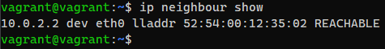  
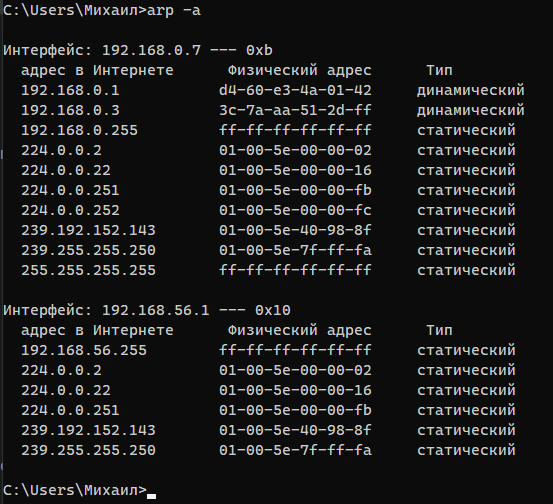  

Очистка ARP-кеша:  

  
  

Удаление нужно IP из ARP-таблицы:  

  
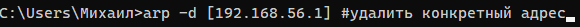
