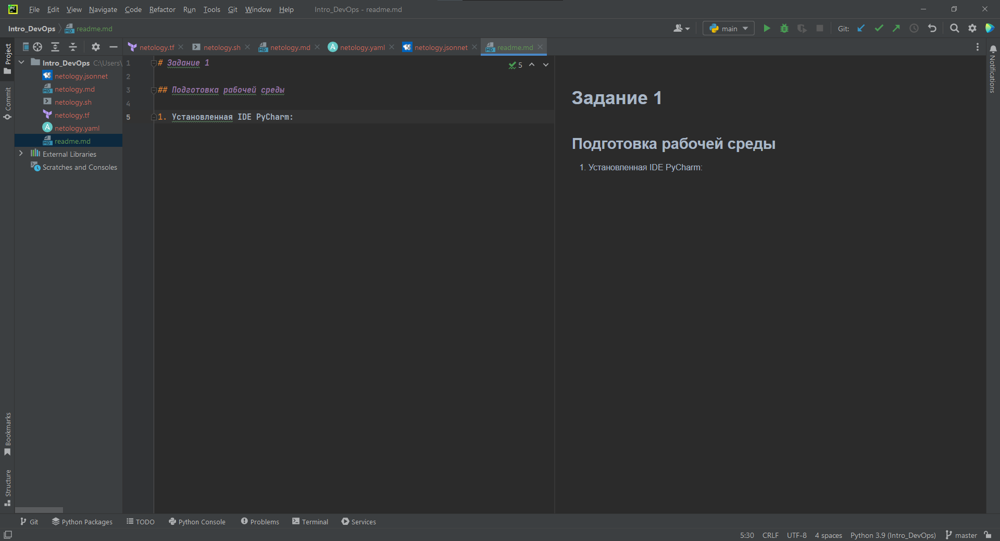
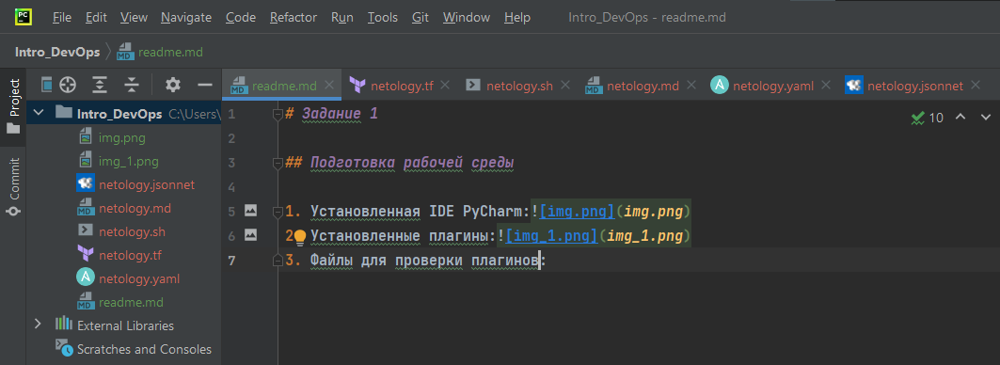
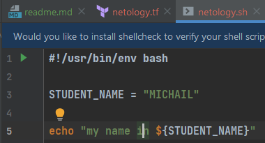
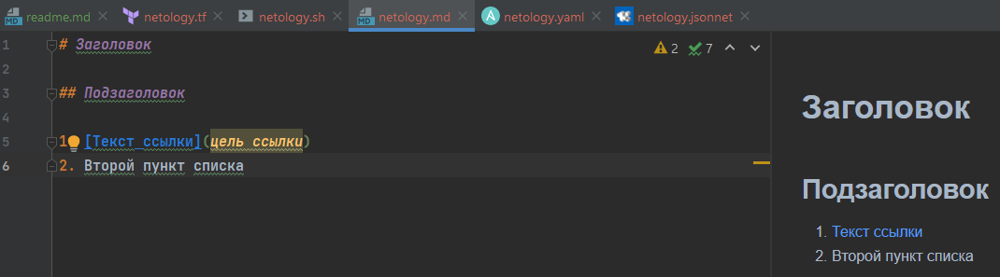
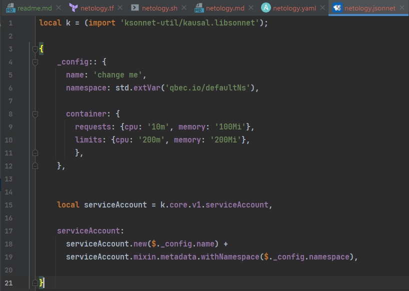

# Задание 1

## Подготовка рабочей среды
Вы пришли на новое место работы или приобрели новый компьютер. Первым делом надо настроить окружение для дальнейшей работы.

1) Установить Py Charm Community Edition - это бесплатная версия IDE.
    В качестве альтернативы можно установить Visual Studio Code и дальнейшие шаги проделать с ним. Таким образом вы сможете выбрать для себя более удобный инструмент.

2) Установить плагины:
        Terraform,
        MarkDown,
        Yaml/Ansible Support,
        Jsonnet.
3) Склонировать текущий репозиторий (команда git clone) или просто создать файлы для проверки плагинов:
    netology.tf – terraform,
    netology.sh – bash,
    netology.md – markdown,
    netology.yaml – yaml,
    netology.jsonnet – jsonnet.

4) Убедитесь, что работает подсветка синтаксиса
 
***

# Решение 1

### Установленная IDE PyCharm:
  
### Установленные плагины:

### Файлы для проверки плагинов:

### Проверка подскветки синтаксиса:

***

# Задание 2

Представьте, что вы работаете в стартапе, который запустил интернет-магазин. Ваш интернет-магазин достаточно успешно развивался, и вот пришло время налаживать процессы: у вас стало больше конечных клиентов, менеджеров и разработчиков.Сейчас от клиентов вам приходят задачи, связанные с разработкой нового функционала. Задач много, и все они требуют выкладки на тестовые среды, одобрения тестировщика, проверки менеджером перед показом клиенту. В случае необходимости, вам будет необходим откат изменений.

Вам необходимо описать процесс решения задачи в соответствии с жизненным циклом разработки программного обеспечения. Использование какого-либо конкретного метода разработки не обязательно. Для решения главное - прописать по пунктам шаги решения задачи (релизации в конечный результат) с участием менеджера, разработчика (или команды разработчиков), тестировщика (или команды тестировщиков) и себя как DevOps-инженера.

***

# Решение 2

### Процесс решения задачи

1. #### Анализ требований

Определяем цели, выгоды, ресурсы для реализации, сроки и т.д.

2. #### Планирование

Архитектура(ЯП, БД, ОС и т.д.), дизайн интерфейсов, безопасность, документация.

3. #### Проектирование

Прежде чем перейти к кодированию (или альтернативным методологиям), разработчик или команда разработчиков должны тщательно спроектировать свой программный продукт. Это важно для оптимизации следующей фазы. На этапе проектирования вам необходимо определить следующее:

* UI: как пользователь будет взаимодействовать с платформой;
* Программирование: какой подход вы будете использовать (код или визуальное программирование, какой язык программирования, какой no-code инструмент)
* Связь: как программное обеспечение будет взаимодействовать с другими активами
* Платформы: на каких платформах будет размещаться программное обеспечение
* Безопасность: какие меры вы собираетесь принять для обеспечения безопасности вашего программного обеспечения?

После проработки первых трёх этапов должно появиться четкое понимание того, каким функционалом должен обладать разрабатываемый инструмент и как он должен выглядеть. Также эти этапы включают в себя вопросы обеспечения безопасности данных пользователей интернет магазина(ISO 31010).

4. #### Разработка

Процесс написания кода разработчиками. Для того чтобы разработчики занимались своим делом, DevOps, если он есть, должен создать для них оптимальную среду разработки. Общий репозиторий, виртуальные машины, контейнеры и т.д. - инструменты, помогающие в автоматизации процессов в зависимости от проекта.  

5. #### Тестирование

Этап, на котором созданное ПО должно быть протестировано. На данном этапе DevOps также работает над автоматизацией процессов тестирования, т.к. меньше ручной работы - меньше вероятность ошибки и выше скорость. 

6. #### Предварительный показ

Предварительный показ ПО клиенту, который проводится менеджером. В процессе собирается обратная связь для последующего внесения правок.  

7. #### Ввод в эксплуатацию

Этап внедрения ПО на выбранных платформах. Здесь DevOps сосредоточен на оптимизации и увеличении производительности. Кроме того, отдельно можно выделить и сопровождение, т.е. - девопс должен обеспечить возможность быстрого и безболезненного внесения изменений и обновлений.

***
