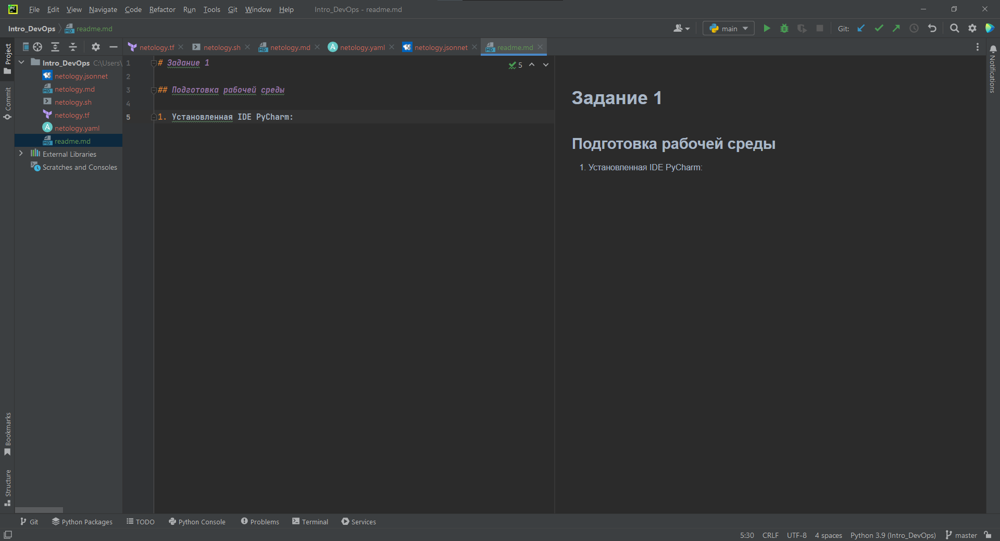
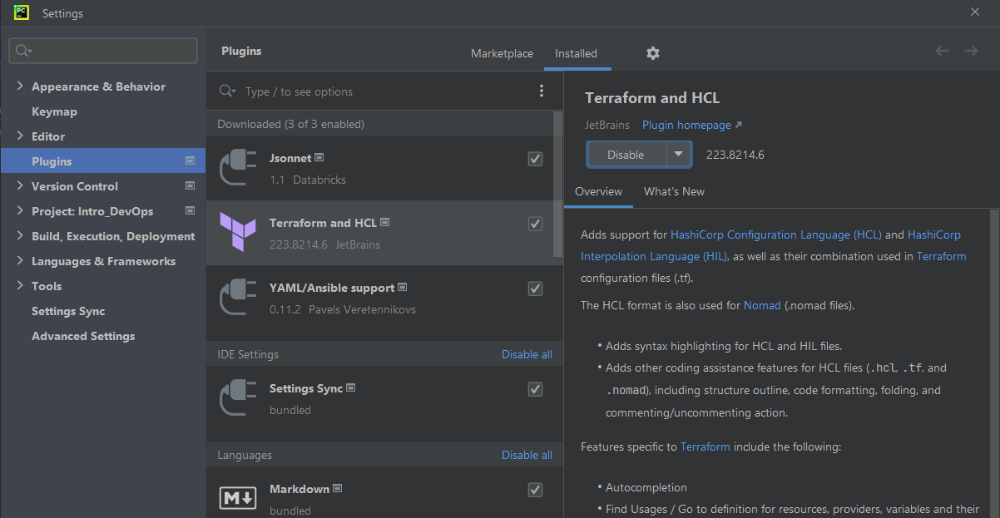
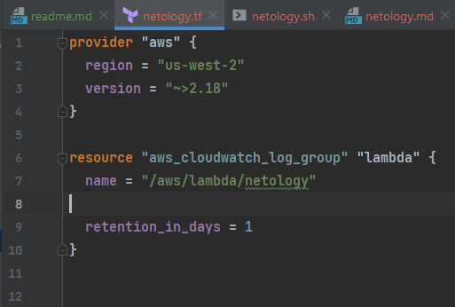
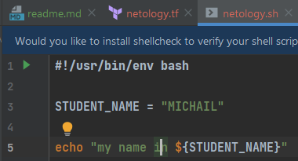
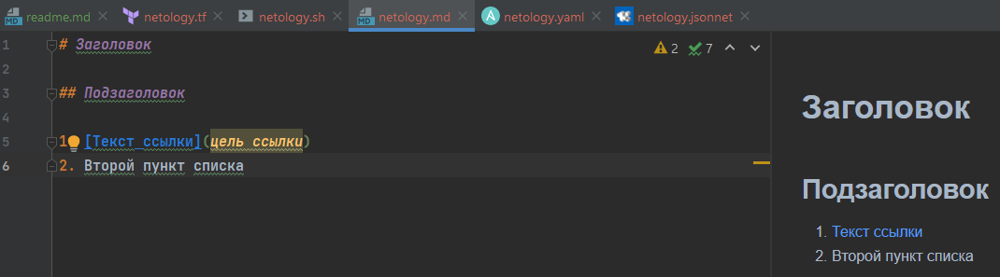
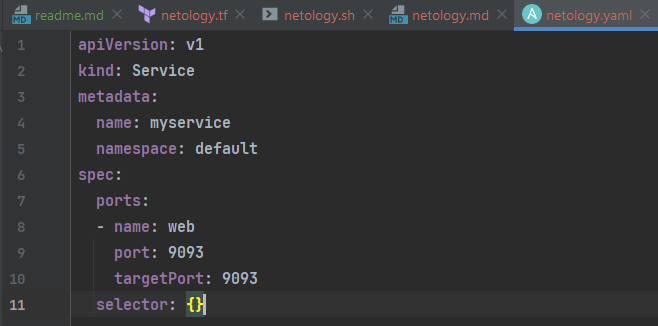
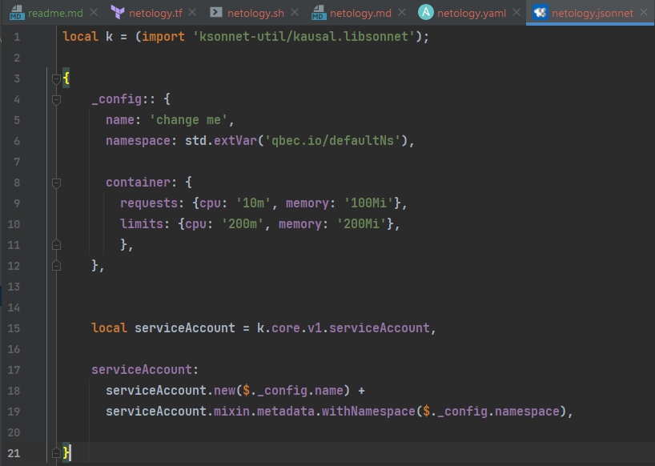

# Задание 1

## Подготовка рабочей среды
Вы пришли на новое место работы или приобрели новый компьютер. Первым делом надо настроить окружение для дальнейшей работы.

1) Установить Py Charm Community Edition - это бесплатная версия IDE.
    В качестве альтернативы можно установить Visual Studio Code и дальнейшие шаги проделать с ним. Таким образом вы сможете выбрать для себя более удобный инструмент.

2) Установить плагины:
        Terraform,
        MarkDown,
        Yaml/Ansible Support,
        Jsonnet.
3) Склонировать текущий репозиторий (команда git clone) или просто создать файлы для проверки плагинов:
    netology.tf – terraform,
    netology.sh – bash,
    netology.md – markdown,
    netology.yaml – yaml,
    netology.jsonnet – jsonnet.

4) Убедитесь, что работает подсветка синтаксиса

# Решение 1

1. ### Установленная IDE PyCharm:
  
2. ### Установленные плагины:

3. ### Файлы для проверки плагинов:

4. ### Проверка подскветки синтаксиса:

# Задание 2

Представьте, что вы работаете в стартапе, который запустил интернет-магазин. Ваш интернет-магазин достаточно успешно развивался, и вот пришло время налаживать процессы: у вас стало больше конечных клиентов, менеджеров и разработчиков.Сейчас от клиентов вам приходят задачи, связанные с разработкой нового функционала. Задач много, и все они требуют выкладки на тестовые среды, одобрения тестировщика, проверки менеджером перед показом клиенту. В случае необходимости, вам будет необходим откат изменений.

Вам необходимо описать процесс решения задачи в соответствии с жизненным циклом разработки программного обеспечения. Использование какого-либо конкретного метода разработки не обязательно. Для решения главное - прописать по пунктам шаги решения задачи (релизации в конечный результат) с участием менеджера, разработчика (или команды разработчиков), тестировщика (или команды тестировщиков) и себя как DevOps-инженера.

# Решение 2

